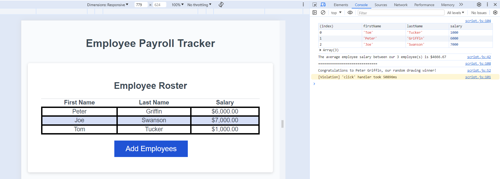

# Employee Payroll Tracker

## Description

A simple JavaScript application to collect and display employees salary data.

It collects the data and shows a sorted table of the employees, sorted by last name.

In the console you can see the numbers of employees, the salary average and a random employee being selected.

## Usage

Visit [App Page](https://ehsanh2001.github.io/employee-payroll-tracker/)

Select "Add Employee" button and follow the instructions.

Go to the console in the browser to see the whole output.

